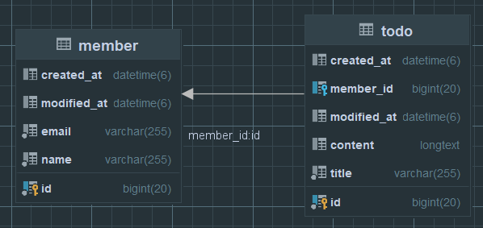

# 일정관리 프로젝트V2

## 개요
- 일정을 `생성`, `조회`, `수정`, `삭제`하고 권한이 있는 사용자가 `일정`을 수정 및 삭제할 수 있습니다. 
- 사용자 권한은 회원가입시 입력한 `비밀번호`를 통해 확인합니다.

## 프로젝트 목표
1. 일정 `생성`, `조회`, `수정`, `삭제` 기능 구현
2. 사용자 `회원가입`, `로그인`, `회원정보수정`, `회원탈퇴`, 기능 구현
4. `로그인` 시 `이메일`과 `비밀번호`를 이용하여 인증
5. 일정에 대한 `댓글` 작성 및 관리


## 주요 기능
### 사용자 생성 및 관리
-  `유저명`, `이메일`, `비밀번호`를 입력하여 회원가입
- 회원가입시 입력한 비밀번호를 암호화 하여 저장
- `로그인` 시 `이메일`과 `비밀번호`를 이용하여 인증
- 댓글 작성 및 관리

### 일정 생성 및 관리
- 작성자가 `제목`, `내용` 을 입력 후 생성
- 작성된 일정을 전체, 상세 `조회` 기능 제공


## API 명세서
(작성예정)

[//]: # ()
[//]: # (| 기능       | 메소드   | URL                | 요청       | 응답       | 상태코드      |)

[//]: # (|----------|-------|--------------------|----------|----------|-----------|)

[//]: # (| 일정등록     | POST  | api/schedules      | 요청 body  | 등록 정보    | 201: 정상등록 |)

[//]: # (| 일정 전체 조회 | GET   | api/schedules      | 요청 param | 단건 응답 정보 | 200: 정상조회 |)

[//]: # (| 일정 상세 조회 | GET   | api/schedules/{id} | 요청 param | 다건 응답 정보 | 200: 정상조회 |)

[//]: # (| 일정 수정    | PATCH | api/schedules/{id} | 요청 body  | 수정 정보    | 200: 정상수정 |)

[//]: # (| 일정 삭제    | PUT   | api/schedules/{id} | 요청 param  | -        | 200: 정상삭제 |)


## ERD


## SQL
```sql
create table member (                        
                        id bigint primary key,                        
                        email varchar(255) not null,
                        name varchar(255) not null,
                        created_at datetime(6),   
                        modified_at datetime(6),                         
);

create table todo (
                      created_at datetime(6),
                      id bigint primary key auto_increment,
                      member_id bigint,
                      modified_at datetime(6),
                      content longtext,
                      title varchar(255) not null,                 
                      constraint FK_SCHEDULE_MEMBER
                          foreign key (member_id) references member(id) on DELETE cascade                                         
);
```