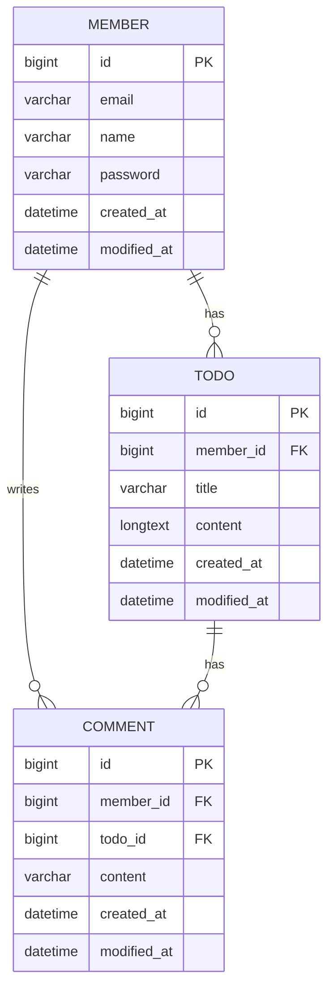

# 일정관리 프로젝트V2

## 개요
- 일정을 `생성`, `조회`, `수정`, `삭제`하고 권한이 있는 사용자가 `일정`을 수정 및 삭제할 수 있습니다.
- 로그인한 사용자는 댓글을 `생성`, `조회`, `수정`, `삭제` 하고 권한이 있는 사용자가 `일정`을 수정 및 삭제할 수 있습니다.
- 사용자 권한은 회원가입시 입력한 `이메일`과 `비밀번호`를 통해 확인합니다.

## 프로젝트 목표
1. 일정 `생성`, `조회`, `수정`, `삭제` 기능 구현
2. 사용자 `회원가입`, `로그인`, `회원정보수정`, `회원탈퇴`, 기능 구현
3. `로그인` 시 `이메일`과 `비밀번호`를 이용하여 인증
4. 일정에 대한 `댓글` 작성 및 관리

## 주요 기능
### 사용자 생성 및 관리
-  `유저명`, `이메일`, `비밀번호`를 입력하여 회원가입
- 회원가입시 입력한 비밀번호를 암호화 하여 저장
- `로그인` 시 `이메일`과 `비밀번호`를 이용하여 인증
- 댓글 작성 및 관리

### 일정 생성 및 관리
- 작성자가 `제목`, `내용` 을 입력 후 생성
- 작성된 일정을 전체, 상세 `조회` 기능 제공

## 프로젝트 요구사항
- [x] API 명세서 작성하기
- [x] ERD 작성하기
- [x] SQL 작성하기
- [x] 일정 CRUD
  - 일정을 `생성`, `조회`,` 수정`, `삭제` 기능 구현
  - 작성 `유저명`, 할일 `제목`, 할일 `내용`, `작성일`, `수정일` 필드 생성


- [x] 유저 CRUD
  - 유저를 `생성`, `조회`,` 수정`, `삭제` 기능 구현
  - `유저명`, `이메일`,`작성일`, `수정일` 필드 생성
  - 유저고유식별자`필드를 통해 일정과 사용자의 `연관관계`를 설정


- [x] 회원가입
  - 유저에 `비밀번호` 필드를 추가
  - 비밀번호는 `PasswordEncoder`를 이용하여 암호화


- [x] 로그인
  - Cookie/Session을 활용해 로그인 기능을 구현
  - 필터를 활용해 인증 처리
  - 이메일과 비밀번호를 활용해 로그인 기능을 구현
  - 회원가입, 로그인 요청은 인증 처리에서 제외
  - 로그인 시 이메일과 비밀번호가 일치하지 않을 경우 `HTTP Status code 401`을 반환


- [x] 예외처리 적용하기
  - `Validation`을 활용해 다양한 예외처리를 적용
    - @Pattern을 사용해서 회원 가입 Email 데이터 검증


- [x] 댓글 CRUD
  - 생성된 일정의 댓글 `저장`, `조회`, `수정`, `삭제` 가능
  - 댓글과 일정의 `연관관계` 설정
  - 댓글 `내용`, 작성일, 수정일, `유저 고유 식별자`, `일정 고유 식별자` 필드 생성


- [x] 일정 페이징 조회
  - 일정을 `Pageable`과 `Page` 인터페이스를 활용하여 페이지네이션을 구현
  - 할일 `제목`, 할일 `내용`, 댓글 `개수`, 일정 `작성일`, 일정 `수정일`, 일정 `작성 유저명 필드`를 조회
  - `페이지 크기`는 `10`으로 적용
  - `수정일`을 기준으로 `내림차순` 정렬


## API 명세서
https://documenter.getpostman.com/view/41318644/2sAYX9nL12

**일정 api**

| 기능       | 메소드   | URL | Parameters                     | RequestBody                              | Resposne                                                                                                                                            | Status Code|
|--------|---|-----|--------------------------------|------------------------------------------|-----------------------------------------------------------------------------------------------------------------------------------------------------|------|
| 일정등록     | POST  | todos    | -                              | `{ "title" : String,"content" : String}` | `{ "id": Long, "title": String, "content":String,"memberId": Long, "username": String}`                                                             | `201 CREATED` |
| 일정 전체 조회 | GET   | todos   | `page` : 페이지 번호 `size`: 페이지 크기 | -                                        | `{ "totalPages": int, "totalElements": int, "content": [ { "id": Long, "title": string, "content": string, "memberId":Long, "username":String} ] }` | `200 OK` |
| 일정 상세 조회 | GET   | todos/{id}| `id`: 일정 id  | -                                        | 다건 응답 정보                                                                                                                                            | `200 OK` |
| 일정 수정    | PATCH | todos/{id} | `id`: 일정 id  | `{ "title" : String,"content" : String}` | -                                                                                                                                                   | `200 OK` |
| 일정 삭제    | DELETE   | todos/{id} |`id`: 일정 id | -                                        | -                                                                                                                                                   | `200 OK` |

**멤버 api**

| 기능        | 메소드   | URL          |parameters  | requestBody | resposne  | status Code   |
|-------|----|--------------|----------------|--------|-----------|---------------|
| 회원가입      | POST  | members/signUp |-|`{"username" : String,"email" : String,"password" : String}`| `{"id":Long ,"email" : String,"username" : String}`  | `201 CREATED` |
| 로그인       | POST  | members/login   |-|`{"email" : String,"password" : String}`| `{"id":Long ,"email" : String,"username" : String}`                                       | `200 OK`      |
| 사용자 전체 조회 | GET   | members      |`page` : 페이지 번호  `size`: 페이지 크기  | - | `{ "totalPages": int,"totalElements": int,"content": [ { "id": Long,"email": string,"username": string} ] }` | `200 OK`      |
| 사용자 상세 조회 | GET   | members/{id} |`id` : 사용자 id  | - | `{"id":Long,"email" : String,"username" : String}`                                        | `200 OK`      |
| 사용자 수정    | PATCH | members/{id}   |`id` : 사용자 id| `{"username" : String,"email" : String,"password" : String}` | -                                                                                         | `200 OK`      |
| 사용자 삭제    | DELETE   | members/{id}   |`id` : 사용자 id , `password` : 비밀번호 | - | -| `200 OK`      |

**댓글 api**

| 기능       | 메소드   | URL | Parameters                          | RequestBody                              | Resposne                                                                                                 | Status Code|
|----------|---|-----|-------------------------------------|------------------------------------------|----|------|
| 댓글 등록    | POST  | comments    | -                                   | `{ "todoId" : Long,"content" : String}`  | `{ "id": Long,"todoId": Long,"content": String,"memberId": Long,"username": String,"createAt": dateTime}`| `201 CREATED` |
| 댓글 전체 조회 | GET   | comments   | `page` : 페이지 번호 `size`: 페이지 크기 | -  | `[{ "id": Long,"title": string,"content": string,"memberId":Long,"username":String,"createAt": dateTime}`]` | `200 OK` |
| 댓글 상세 조회 | GET   | comments/{id}| `id`: 댓글 id  | - | `{ "id": Long,"title": string,"content": string,"memberId":Long,"username":String,"createAt": dateTime}`| `200 OK` |
| 댓글 수정    | PATCH | comments/{id} | `id`: 일정 id  | `{ "todoId" : Long,"content" : String}` | -| `200 OK` |
| 댓글 삭제    | DELETE   | comments/{id} | `id`: 일정 id  | - | - | `200 OK` |


## ERD



## SQL
```sql
create table member (
                        id bigint not null,
                        email varchar(50) not null,
                        name varchar(20) not null,
                        password varchar(100) not null,
                        created_at datetime(6),
                        modified_at datetime(6),
                        primary key (id)
);

create table todo (
                      id bigint not null auto_increment,
                      member_id bigint not null ,
                      title varchar(30) not null,
                      content longtext not null ,
                      created_at datetime(6) not null,
                      modified_at datetime(6) not null,
                      primary key (id)
);

create table comment (
                         id bigint not null auto_increment,
                         member_id bigint not null ,
                         todo_id bigint not null,
                         content varchar(255) not null,
                         created_at datetime(6) not null,
                         modified_at datetime(6) not null,                         
                         primary key (id)
);

alter table todo
    add constraint FK_member_id
        foreign key (member_id)
            references member (id);

alter table comment
    add constraint FK_todo_id
        foreign key (todo_id)
            references todo (id);

alter table comment
    add constraint FK_member_id
        foreign key (member_id)
            references member (id)

```